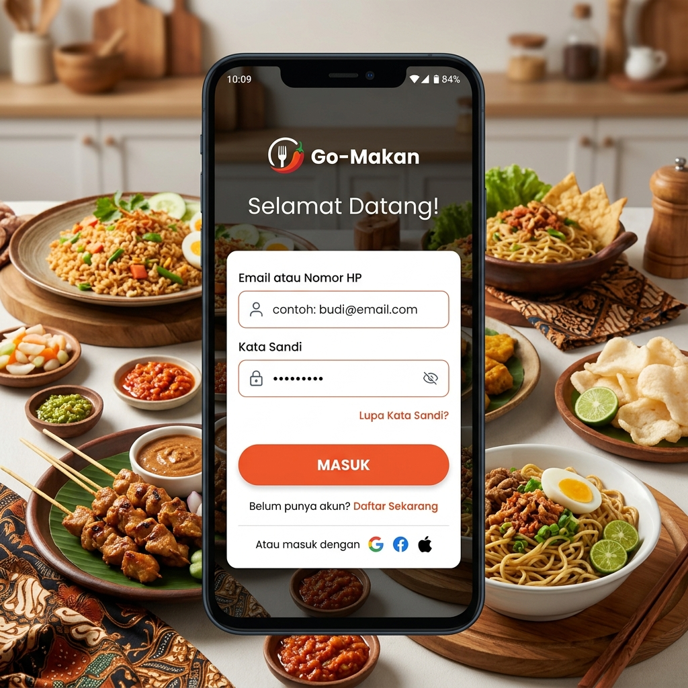
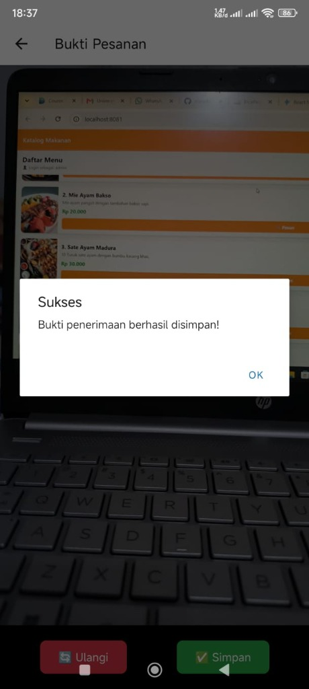
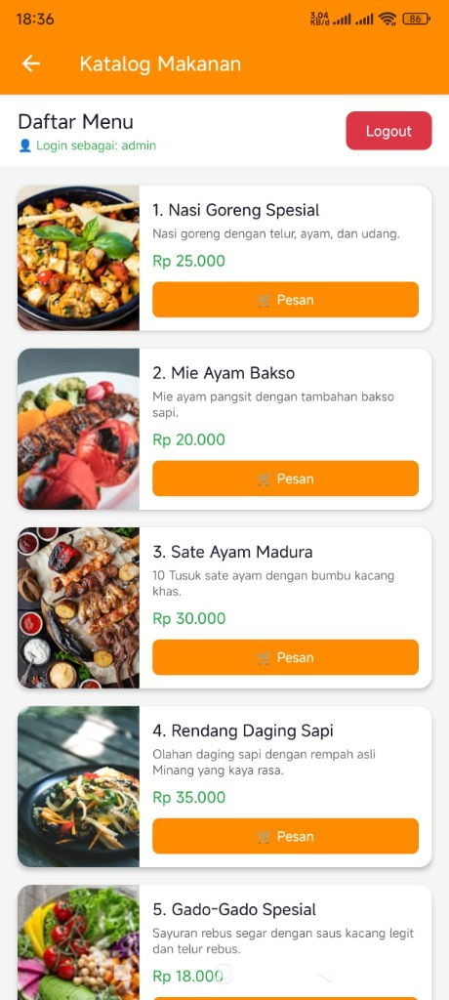

# 🍱 FoodDelivery App — UAS Pemrograman Mobile

Aplikasi pemesanan makanan berbasis **React Native (Expo)** yang dibangun sebagai proyek UAS Mata Kuliah Pemrograman Mobile. Aplikasi menampilkan katalog 10 menu makanan khas Indonesia, sistem autentikasi JWT, fitur kamera untuk bukti penerimaan, dan peta untuk lokasi pengiriman.

---

## 📱 Tampilan Aplikasi

| Halaman Login | Katalog Makanan | Detail Pesanan |
|:---:|:---:|:---:|
|  |  |  |
| Autentikasi dengan JWT mock | 10 menu makanan bernomor urut | Info detail + tombol Pesan |

---

## ✨ Fitur Utama

- 🔐 **Autentikasi JWT** — Login/logout dengan token yang disimpan di `AsyncStorage`. Proteksi halaman dengan Auth Guard di `_layout.tsx`.
- 🍽️ **Katalog Makanan** — 10 menu makanan khas Indonesia dengan foto, deskripsi, dan harga, bernomor urut.
- 🛒 **Detail Pesanan** — Halaman detail yang hanya bisa diakses setelah login.
- 🗺️ **Peta Lokasi** — Menampilkan lokasi pengiriman menggunakan `react-native-maps` (membutuhkan perangkat fisik/Expo Go).
- 📸 **Kamera** — Ambil foto bukti penerimaan menggunakan `expo-camera` (membutuhkan perangkat fisik/Expo Go).
- 🔄 **Auto-Redirect** — Otomatis diarahkan ke halaman login jika belum login atau setelah logout.

---

## 🛠️ Teknologi yang Digunakan

| Teknologi | Keterangan |
|---|---|
| [Expo SDK 54](https://expo.dev/) | Framework React Native |
| [Expo Router](https://expo.github.io/router/) | File-based navigation |
| [AsyncStorage](https://react-native-async-storage.github.io/) | Penyimpanan token JWT lokal |
| [expo-camera](https://docs.expo.dev/versions/latest/sdk/camera/) | Akses kamera perangkat |
| [react-native-maps](https://github.com/react-native-maps/react-native-maps) | Tampilan peta interaktif |
| [expo-location](https://docs.expo.dev/versions/latest/sdk/location/) | Akses GPS / lokasi |
| MySQL + phpMyAdmin | Database backend |

---

## 🚀 Cara Menjalankan Aplikasi

### Prasyarat
- Node.js (v18+)
- npm
- Aplikasi **Expo Go** di HP (Android/iOS) — versi 54.x dari Play Store / App Store
- XAMPP (untuk database MySQL)

### Langkah Instalasi

1. **Clone repository ini:**
   ```bash
   git clone https://github.com/marvdav01/UAS-Pemrograman-Mobile.git
   cd UAS-Pemrograman-Mobile/FoodDelivery
   ```

2. **Install dependensi:**
   ```bash
   npm install --legacy-peer-deps
   ```

3. **Jalankan server Expo:**
   ```bash
   npx expo start -c
   ```

4. **Buka di HP:**
   - Pastikan HP dan laptop terhubung ke **WiFi yang sama**.
   - Buka aplikasi **Expo Go** di HP.
   - Scan **QR Code** yang muncul di terminal.

5. **Buka di Browser (Web):**
   - Tekan tombol `w` di terminal, atau jalankan:
   ```bash
   npx expo start --web
   ```
   > ⚠️ Fitur Peta dan Kamera **tidak tersedia** di versi Web, hanya bisa diakses melalui Expo Go di HP.

---

## 🗄️ Setup Database (phpMyAdmin)

1. Jalankan **XAMPP** dan aktifkan **Apache** dan **MySQL**.
2. Buka `http://localhost/phpmyadmin`.
3. Buat database baru bernama `food_delivery`.
4. Klik tab **"SQL"**, lalu jalankan file `database.sql` yang ada di root proyek ini.
5. Verifikasi bahwa tabel `foods` (10 baris) dan `users` (2 baris) sudah terbuat.

---

## 🔑 Kredensial Login

| Role | Username | Password |
|---|---|---|
| Admin | `admin` | `admin` |
| Customer | `user` | `user123` |

---

## 📁 Struktur Proyek

```
FoodDelivery/
├── src/
│   ├── app/
│   │   ├── _layout.tsx      # Auth Guard & Root Layout
│   │   ├── index.tsx        # Halaman Katalog Makanan
│   │   ├── login.tsx        # Halaman Login
│   │   ├── detail.tsx       # Halaman Detail Pesanan
│   │   ├── kamera.tsx       # Halaman Kamera
│   │   └── peta.tsx         # Halaman Peta
│   └── context/
│       └── AuthContext.tsx  # Context API untuk Auth
├── database.sql             # Script SQL untuk setup database
├── app.json                 # Konfigurasi Expo
└── package.json
```

---

## 📚 Analisis Teknis

### 1. Alasan Penggunaan Flexbox
Dalam pengembangan aplikasi seluler, layar memiliki berbagai ukuran, kepadatan piksel (DPI), dan orientasi. Penggunaan **Flexbox** sangat penting karena:
- **Responsivitas Otomatis**: Konten secara dinamis mendistribusikan ruang tanpa perlu menulis ukuran piksel yang kaku.
- **Konsistensi UI**: Gambar dan informasi produk tetap sejajar dan rapi di berbagai ukuran layar.
- Pada `index.tsx`, `flex: 1` pada kontainer info memastikan ia mengisi seluruh sisa lebar di samping gambar produk.

### 2. Stateful vs Stateless Authentication (JWT)

| | Stateful (Session) | Stateless (JWT) ✅ |
|---|---|---|
| **Penyimpanan** | Di server (database/Redis) | Di klien (AsyncStorage) |
| **Skalabilitas** | Sulit (server harus ingat sesi) | Mudah (tidak ada state di server) |
| **Performa** | Lambat (lookup DB tiap request) | Cepat (verifikasi lokal) |
| **Cocok untuk** | Aplikasi web tradisional | Aplikasi mobile & REST API ✅ |

**Alasan memilih JWT pada aplikasi mobile:**
1. **Skalabilitas**: API tidak perlu menyimpan state sesi, lebih efisien untuk REST API.
2. **Fleksibilitas**: Mudah diintegrasikan dari React Native via `AsyncStorage`.
3. **Offline-Ready**: Data dalam token (seperti role pengguna) bisa dibaca lokal untuk mengontrol UI tanpa memanggil API setiap saat.

---

## 👨‍💻 Pengembang

Dibuat sebagai **Ujian Akhir Semester (UAS)** Mata Kuliah Pemrograman Mobile.

